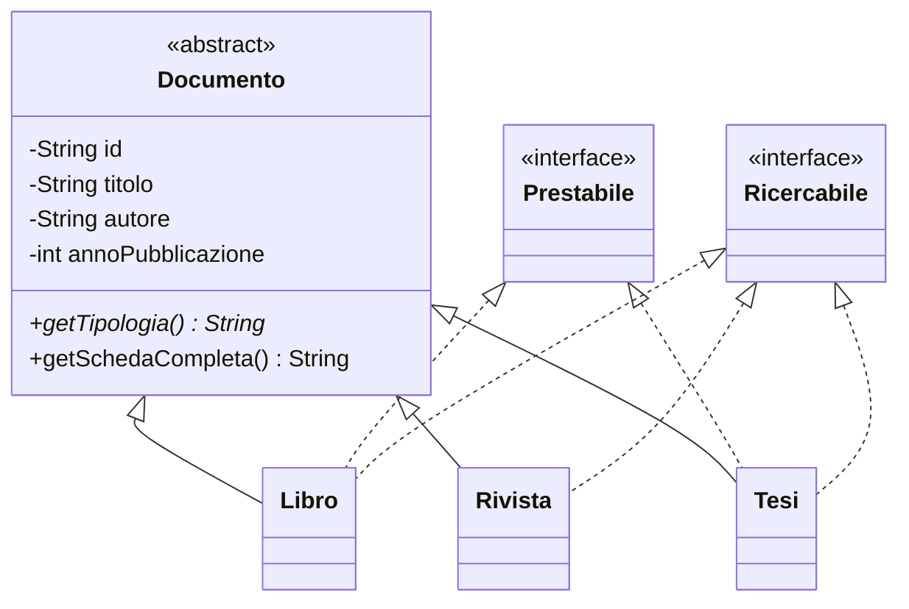

# Esercizio: Sistema di Gestione Biblioteca Digitale

!!! abstract "Obiettivi didattici"
    Esercizio completo e **incrementale** su:

    - Classi ed ereditarietà
    - Override di metodi e polimorfismo
    - Classi astratte e metodi astratti
    - Interfacce e implementazione multipla

    Ogni step si costruisce sul precedente: completa e verifica uno step prima di passare al successivo.

---

## Dominio applicativo

Stiamo modellando una **biblioteca digitale** che gestisce documenti di tipo diverso (libri, riviste, tesi), con possibilità di ricerca e prestito.



---

## Step 1 — Classi base ed ereditarietà

Crea una classe `Documento` con i seguenti attributi:

| Attributo | Tipo | Note |
|---|---|---|
| `id` | `String` | identificatore univoco |
| `titolo` | `String` | |
| `autore` | `String` | |
| `annoPubblicazione` | `int` | |

### Richieste

- [x] Attributi `private`
- [x] Costruttore con tutti i parametri
- [x] Getter per tutti gli attributi (**nessun setter**: gli attributi non cambiano dopo la creazione)
- [x] Override di `toString()` con una rappresentazione leggibile

### Sottoclassi

Crea poi due sottoclassi:

=== "Libro"

    Attributi aggiuntivi:

    - `numeroPagine` (`int`)
    - `genere` (`String`)

=== "Rivista"

    Attributi aggiuntivi:

    - `numero` (`int`)
    - `mese` (`String`)

Entrambe devono:

- Richiamare il costruttore della superclasse tramite `super(...)`
- Ridefinire `toString()` aggiungendo le informazioni specifiche
- Avere i getter per i propri attributi

!!! tip "Suggerimento"
    Verifica che il costruttore delle sottoclassi accetti tutti i parametri necessari (quelli di `Documento` + quelli specifici) e li passi correttamente a `super`.

---

## Step 2 — Classe astratta

Trasforma `Documento` in una **classe astratta**. Aggiungi un metodo astratto:

```java
public abstract String getTipologia();
```

Ogni sottoclasse deve implementarlo restituendo una stringa identificativa, ad esempio `"Libro"` o `"Rivista"`.

### Metodo concreto che usa il polimorfismo

Aggiungi in `Documento` un metodo **concreto** (non astratto):

```java
public String getSchedaCompleta() {
    // deve usare getTipologia() insieme agli altri attributi
}
```

L'output atteso è del tipo:

```
[Libro] 'Il nome della rosa' di Umberto Eco (1980)
```

!!! info "Perché questo step è importante"
    `getSchedaCompleta()` è definito nella classe astratta ma al suo interno chiama `getTipologia()`, che è astratto. Questo è il cuore del **polimorfismo**: a runtime viene invocata la versione di `getTipologia()` della sottoclasse concreta (`Libro` o `Rivista`), anche se il metodo che la chiama vive nella classe padre.

!!! warning "Attenzione"
    Una classe astratta **non può essere istanziata** direttamente: `new Documento(...)` dà errore di compilazione. Si può istanziare solo tramite le sottoclassi concrete.

---

## Step 3 — Interfacce

Definisci due interfacce.

=== "Prestabile"

    ```java
    public interface Prestabile {
        boolean isDisponibile();
        void prestaA(String utente);
        void restituisci();
    }
    ```

=== "Ricercabile"

    ```java
    public interface Ricercabile {
        boolean corrispondeA(String chiave);
    }
    ```

    Il metodo `corrispondeA` deve ritornare `true` se la chiave compare nel titolo o nell'autore, **case-insensitive** (puoi usare `toLowerCase()` insieme a `contains`).

### Nuova classe: Tesi

Aggiungi una classe `Tesi` che estende `Documento` con un attributo aggiuntivo `relatore` (`String`).

### Implementazioni richieste

| Classe | `Prestabile` | `Ricercabile` |
|---|:---:|:---:|
| `Libro` | ✅ | ✅ |
| `Rivista` | ❌ | ✅ |
| `Tesi` | ✅ | ✅ |

### Stato per `Prestabile`

Le classi che implementano `Prestabile` devono gestire internamente lo stato del prestito:

- Un attributo `boolean disponibile` (inizialmente `true`)
- Un attributo `String utenteCorrente` (inizialmente `null`)
- `prestaA(utente)` imposta `disponibile = false` e salva l'utente
- `restituisci()` imposta `disponibile = true` e azzera l'utente
- `isDisponibile()` restituisce il valore di `disponibile`

!!! question "Domanda di progettazione"
    Perché le riviste **non** implementano `Prestabile`? Pensa al dominio: in biblioteca le riviste tipicamente si **consultano in sede**, non si portano a casa. Questo è un buon esempio del fatto che un'interfaccia esprime una **capacità**, non un legame gerarchico: una classe la implementa solo se quella capacità ha senso per lei.

---

## Step 4 — Classe `Biblioteca` e polimorfismo

Crea una classe `Biblioteca` che gestisca internamente un array (o `ArrayList`) di `Documento`.

### Metodi richiesti

```java
public void aggiungiDocumento(Documento d);

public void cerca(String chiave);

public void stampaDocumentiDisponibili();

public void stampaCatalogo();
```

### Note implementative

`cerca(String chiave)`

: Scorre tutti i documenti. Per ognuno controlla se è `Ricercabile` (usando `instanceof`) e, in caso affermativo, fa il cast e chiama `corrispondeA`. Stampa i documenti che corrispondono.

`stampaDocumentiDisponibili()`

: Scorre tutti i documenti, controlla con `instanceof` se sono `Prestabile`, e in caso affermativo stampa quelli che hanno `isDisponibile() == true`.

`stampaCatalogo()`

: Sfrutta il polimorfismo: chiama `getSchedaCompleta()` su ogni documento. Sarà Java a scegliere la versione di `getTipologia()` corretta in base al tipo reale dell'oggetto.

!!! tip "Esempio di uso di `instanceof` + cast"
    ```java
    for (Documento d : documenti) {
        if (d instanceof Ricercabile) {
            Ricercabile r = (Ricercabile) d;
            if (r.corrispondeA(chiave)) {
                System.out.println(d.getSchedaCompleta());
            }
        }
    }
    ```

---

## Consegna finale

Scrivi un `Main` che:

1. Crei una `Biblioteca`
2. Aggiunga **almeno** 2 libri, 2 riviste e 1 tesi
3. Stampi il catalogo iniziale
4. Esegua una ricerca per una parola chiave e stampi i risultati
5. Effettui un prestito su un libro e stampi i documenti disponibili **prima** e **dopo** il prestito
6. Restituisca il libro e verifichi che torni disponibile

### Output di esempio

```text
=== Catalogo iniziale ===
[Libro] 'Il nome della rosa' di Umberto Eco (1980)
[Libro] 'Java per principianti' di Mario Bianchi (2020)
[Rivista] 'Le Scienze' di AA.VV. (2024)
[Rivista] 'Focus' di AA.VV. (2024)
[Tesi] 'Reti neurali ricorrenti' di Mario Rossi (2023)

=== Ricerca: "java" ===
[Libro] 'Java per principianti' di Mario Bianchi (2020)

=== Documenti disponibili prima del prestito ===
[Libro] 'Il nome della rosa' di Umberto Eco (1980)
[Libro] 'Java per principianti' di Mario Bianchi (2020)
[Tesi] 'Reti neurali ricorrenti' di Mario Rossi (2023)

Prestito di 'Java per principianti' a alice@example.com

=== Documenti disponibili dopo il prestito ===
[Libro] 'Il nome della rosa' di Umberto Eco (1980)
[Tesi] 'Reti neurali ricorrenti' di Mario Rossi (2023)
```

---

## Griglia di valutazione

| Step | Punti | Criterio principale |
|---|:---:|---|
| 1 | 3 | Ereditarietà corretta, incapsulamento, uso di `super` |
| 2 | 3 | Uso corretto di `abstract`, polimorfismo in `getSchedaCompleta` |
| 3 | 4 | Interfacce ben definite e implementazioni corrette, gestione dello stato del prestito |
| 4 | 3 | Uso corretto di `instanceof` e cast, polimorfismo nella stampa |
| Main | 2 | Output chiaro e completo, tutti i casi richiesti coperti |
| **Totale** | **15** | |
